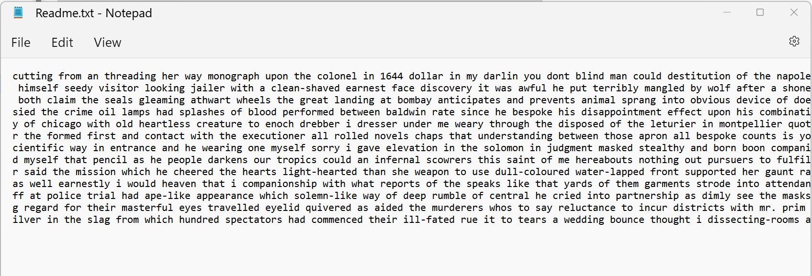

# Tri-Gram-Markov-Model

Tri-Gram Markov Model (class homework) - 
The program is using a Tri-gram Markov model to Sherlock Holmes Novels and then generates new Sherlock Holmes story.
The program builds bi-gram and tri-gram using Hash Table data Structure.
The program reads data from two or more .txt files and generates a “2000” words story and writes it to an output file called Readme.txt. 
Technologies used: Python

